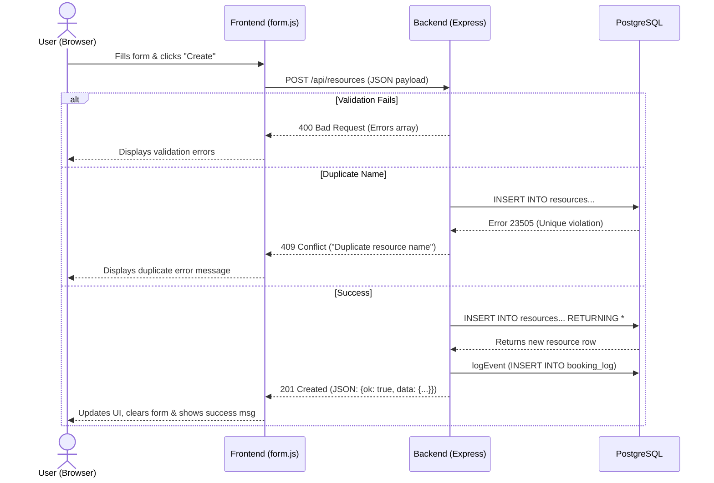
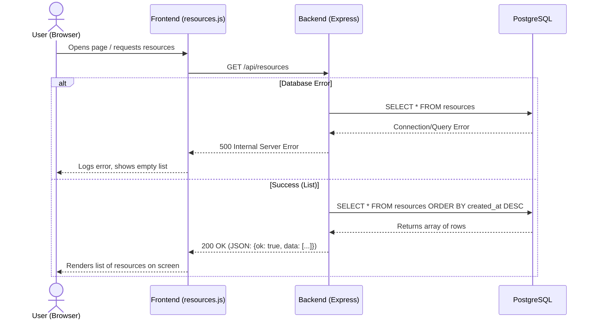
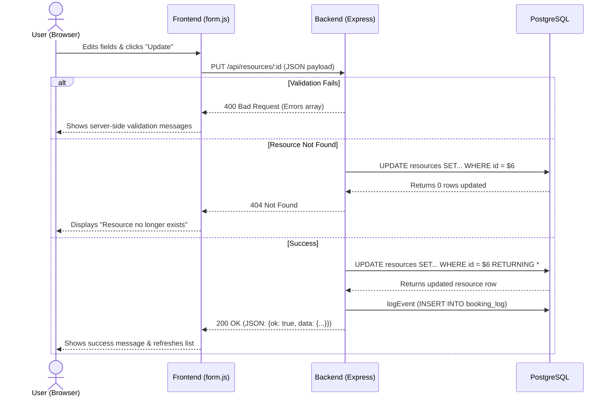
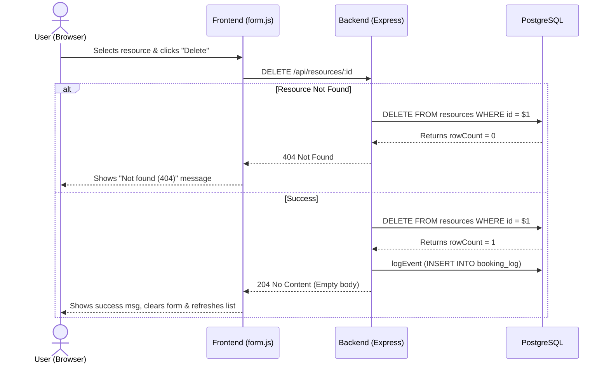

# G1: CRUD Operations Data Flow (Phase 6)

## 1. CREATE Operation

```mermaid
sequenceDiagram
    actor User as User (Browser)
    participant UI as Frontend (form.js)
    participant API as Backend (Express)
    participant DB as PostgreSQL

    User->>UI: Fills form & clicks "Create"
    UI->>API: POST /api/resources (JSON payload)
    
    alt Validation Fails
        API-->>UI: 400 Bad Request (Errors array)
        UI-->>User: Displays validation errors
    else Duplicate Name
        API->>DB: INSERT INTO resources...
        DB-->>API: Error 23505 (Unique violation)
        API-->>UI: 409 Conflict ("Duplicate resource name")
        UI-->>User: Displays duplicate error message
    else Success
        API->>DB: INSERT INTO resources... RETURNING *
        DB-->>API: Returns new resource row
        API->>DB: logEvent (INSERT INTO booking_log)
        API-->>UI: 201 Created (JSON: {ok: true, data: {...}})
        UI-->>User: Updates UI, clears form & shows success msg
    end
```

## 2. READ Operation

```mermaid
sequenceDiagram
    actor User as User (Browser)
    participant UI as Frontend (resources.js)
    participant API as Backend (Express)
    participant DB as PostgreSQL

    User->>UI: Opens page / requests resources
    UI->>API: GET /api/resources
    
    alt Database Error
        API->>DB: SELECT * FROM resources
        DB-->>API: Connection/Query Error
        API-->>UI: 500 Internal Server Error
        UI-->>User: Logs error, shows empty list
    else Success (List)
        API->>DB: SELECT * FROM resources ORDER BY created_at DESC
        DB-->>API: Returns array of rows
        API-->>UI: 200 OK (JSON: {ok: true, data: [...]})
        UI-->>User: Renders list of resources on screen
    end
```

## 3. UPDATE Operation

```mermaid
sequenceDiagram
    actor User as User (Browser)
    participant UI as Frontend (form.js)
    participant API as Backend (Express)
    participant DB as PostgreSQL

    User->>UI: Edits fields & clicks "Update"
    UI->>API: PUT /api/resources/:id (JSON payload)
    
    alt Validation Fails
        API-->>UI: 400 Bad Request (Errors array)
        UI-->>User: Shows server-side validation messages
    else Resource Not Found
        API->>DB: UPDATE resources SET... WHERE id = $6
        DB-->>API: Returns 0 rows updated
        API-->>UI: 404 Not Found
        UI-->>User: Displays "Resource no longer exists"
    else Success
        API->>DB: UPDATE resources SET... WHERE id = $6 RETURNING *
        DB-->>API: Returns updated resource row
        API->>DB: logEvent (INSERT INTO booking_log)
        API-->>UI: 200 OK (JSON: {ok: true, data: {...}})
        UI-->>User: Shows success message & refreshes list
    end
```

## 4. DELETE Operation

```mermaid
sequenceDiagram
    actor User as User (Browser)
    participant UI as Frontend (form.js)
    participant API as Backend (Express)
    participant DB as PostgreSQL

    User->>UI: Selects resource & clicks "Delete"
    UI->>API: DELETE /api/resources/:id
    
    alt Resource Not Found
        API->>DB: DELETE FROM resources WHERE id = $1
        DB-->>API: Returns rowCount = 0
        API-->>UI: 404 Not Found
        UI-->>User: Shows "Not found (404)" message
    else Success
        API->>DB: DELETE FROM resources WHERE id = $1
        DB-->>API: Returns rowCount = 1
        API->>DB: logEvent (INSERT INTO booking_log)
        API-->>UI: 204 No Content (Empty body)
        UI-->>User: Shows success msg, clears form & refreshes list
    end
```